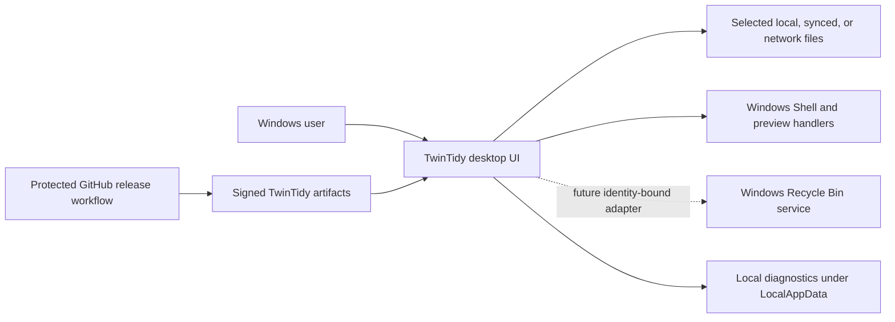
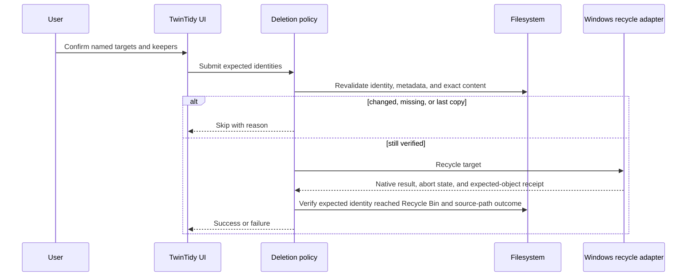

# TwinTidy Architecture

Status: production target and active guardrail, 2026-07-10

## 1. Purpose and quality goals

TwinTidy is a local Windows desktop application that finds byte-for-byte duplicate user files and helps a person reclaim storage without surrendering control of their data.

The quality goals, in priority order, are:

1. **File safety:** never remove a changed, unverified, or last retained copy by default.
2. **Truthful outcomes:** report success only when Windows and a post-operation check agree.
3. **Privacy:** scan locally, avoid telemetry by default, and keep diagnostics free of file contents.
4. **Responsiveness:** keep filesystem and preview work off the UI thread and make cancellation effective.
5. **Portability within Windows:** ship native `amd64` and `arm64` executables without CGO or an auxiliary runtime.
6. **Auditability:** keep decisions, results, release metadata, and failures understandable to users and maintainers.

## 2. Scope and constraints

TwinTidy detects exact duplicates. Similar images, equivalent documents, or re-encoded media are outside the exact-match contract unless a future, separately labeled feature is approved.

Exact matching is storage-oriented and hardware-independent. TwinTidy uses bounded concurrent I/O and the Go runtime's available CPU acceleration; it does not require or dispatch hashing to a GPU. A future similarity engine may use optional GPU acceleration only behind a separately tested adapter with deterministic CPU fallback.

Production support is Windows on `amd64` and `arm64`. The application uses Go, `github.com/lxn/walk`, and Windows APIs. Release binaries set `CGO_ENABLED=0`; no MSYS2, MinGW, GCC, browser service, account, or cloud backend is required.

The application does not own user files. It receives narrowly scoped authority to inspect selected roots. A future cleanup action may recycle only targets the user explicitly confirms after verification; the current production adapter is disabled because the documented Windows Shell handoff is path-based rather than file-identity-bound.

## 3. System context



Trust boundaries and abuse cases are defined in `docs/SECURITY_MODEL.md`.

## 4. Containers and components

TwinTidy is a modular desktop monolith.

| Component | Current location | Responsibility | Must not own |
|---|---|---|---|
| Process entry point | `cmd/twintidy` | startup, exit status, build/version presentation | scan or deletion policy |
| GUI adapter | `internal/gui` | Walk widgets, dialogs, preview presentation, UI-thread marshaling | filesystem truth |
| Application workflow | presently coordinated in `internal/gui`; target is a testable coordinator | operation generations, state transitions, commands, result publication | native API details |
| Scanner | `internal/scanner` | root validation, enumeration, metadata snapshot, staged hashing, duplicate grouping | user confirmation |
| Deletion policy | `internal/scanner` while the boundary is extracted | keeper guarantees, expected identity, pre-action revalidation | Windows UI state |
| Windows recycle adapter | `internal/scanner/recycle_windows.go` | fail-closed capability gate; future identity-bound native recycle | path-only destructive authority or duplicate selection policy |
| Preview adapters | `internal/gui` Windows files | Shell thumbnails and constrained rich/text previews | destructive authority |
| Diagnostics | `internal/diagnostics` | local session logs and privacy-limited crash reports | file contents or secrets |
| Build information | target `internal/buildinfo` | semantic version, commit, source date | runtime update checks |

Boundary direction is UI -> application policy -> scanner/deletion abstractions -> Windows/filesystem adapters. Native adapter types must not leak into policy tests.

## 5. Core data and ownership

A scan record is a snapshot, not permanent truth. It contains the path, observed metadata, category, hashes, and a stable Windows file identity when available. The filesystem remains authoritative and must be queried again at destructive-action time.

A verified duplicate group contains at least two distinct file identities whose exact hashes agree. Hard links to the same underlying file are not separate reclaimable copies and must not inflate recoverable-byte estimates.

A deletion request contains explicit expected identity data, selected targets, their verified group, and at least one unselected retained member. The recycle result is structured as recycled, skipped-changed, skipped-protected, cancelled, or failed; invalid requests and ambiguous native outcomes are failures.

## 6. Runtime behavior

### Scan

1. Validate the selected root lexically and after resolving relevant reparse-point behavior.
2. Start a new operation generation and cancel or invalidate earlier work.
3. Enumerate eligible regular user files without following unsafe links.
4. Snapshot metadata and group by exact size.
5. Apply boundary hashing, then streaming SHA-256 confirmation.
6. Recheck identity/metadata around hashing and mark changed files rather than silently trusting stale data.
7. Publish results only if the operation generation is still current.

### Recycle target (currently disabled)

The policy and state transitions below define the acceptance target. The current Windows production adapter returns unsupported before the native boundary, retains every file and row, and never enters the Shell operation. ADR 0005 records why path-derived `IShellItem` operations cannot satisfy this sequence.



Permanent deletion is not an automatic recovery path. If ever offered, it is a separately initiated command with stronger confirmation and its own ADR.

## 7. State and concurrency

The application state machine is:

```text
NoFolder -> FolderReady -> SurfaceScanning/Cancelling -> SurfaceReady
SurfaceReady -> DuplicateScanning/Cancelling -> ResultsReady
ResultsReady -> Deleting -> ResultsReady
Deleting -> ClosingAfterDelete -> Closing
```

Cancellation returns to the last coherent state. Every asynchronous operation carries an immutable generation identifier and folder revision. UI callbacks compare both inside the UI-thread callback before changing state or rows. Only one foreground operation may be active. Closing during a scan cancels and invalidates that work. When an identity-bound native recycle adapter is available, closing during that operation is deferred until its matching result has been applied. Late callbacks cannot mutate the next folder or window lifecycle.

Hash loops and directory enumeration check context between bounded reads or entries. Slow files must not make cancellation wait until EOF.

## 8. Deployment

The shipped units are a portable Windows GUI executable archive and a per-user MSIX. Separate artifacts are built for `amd64` and `arm64`. Each executable embeds the Common Controls v6 manifest, per-monitor DPI settings, product icon, and version metadata. The MSIX uses the exact certificate-subject publisher identity and Windows-managed registration, upgrade, uninstall, and reinstall behavior defined by ADR 0006.

Unsigned binaries are built reproducibly and attested. Authenticode signing and timestamping occur after reproducibility verification. The application runs as the current user (`asInvoker`) and must not request elevation for normal operation.

## 9. Cross-cutting rules

- Paths in logs are limited to what is necessary for support; file contents, hashes that are not needed, environment dumps, and secrets are excluded.
- Portable diagnostics use `%LOCALAPPDATA%\TwinTidy\logs`. MSIX may virtualize that path into package-private application data, which Windows removes with the package; users must export logs they need before uninstalling.
- Previews are untrusted input. Use bounded reads, constrain navigation, and avoid automatic macro/script execution.
- Errors are actionable and preserve rows when an outcome is uncertain.
- Accessibility uses native focus, keyboard, contrast, high-DPI, and screen-reader behavior.
- Material architecture changes require an ADR and aligned updates to this file and the security model.

## 10. Production acceptance

A stable release requires the complete verification matrix in `docs/RELEASE.md`, native smoke tests on both architectures, destructive fault injection, signature verification, an independent safety review, and native MSIX install, upgrade, uninstall, and reinstall evidence. Portable archives remain a required baseline artifact.
